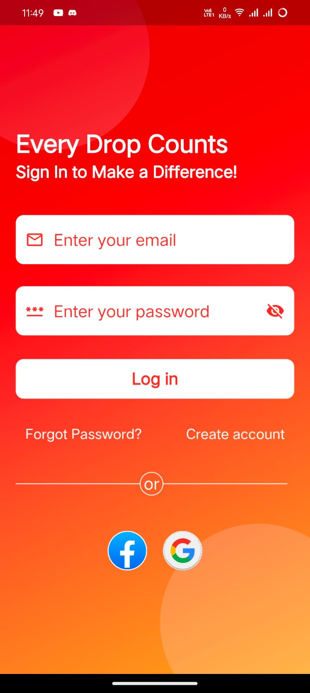
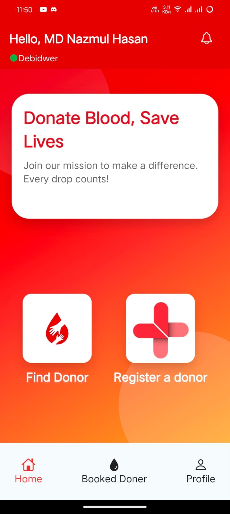
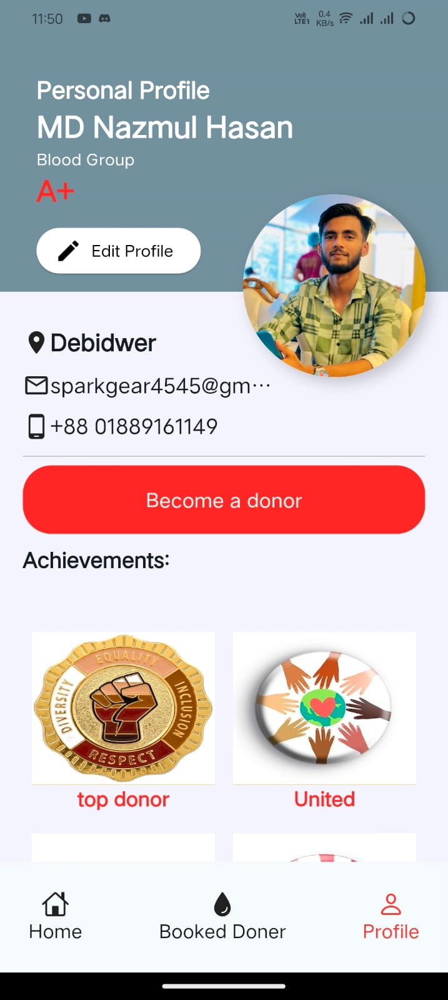
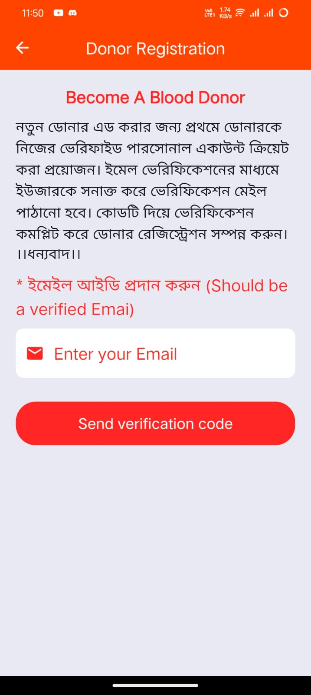
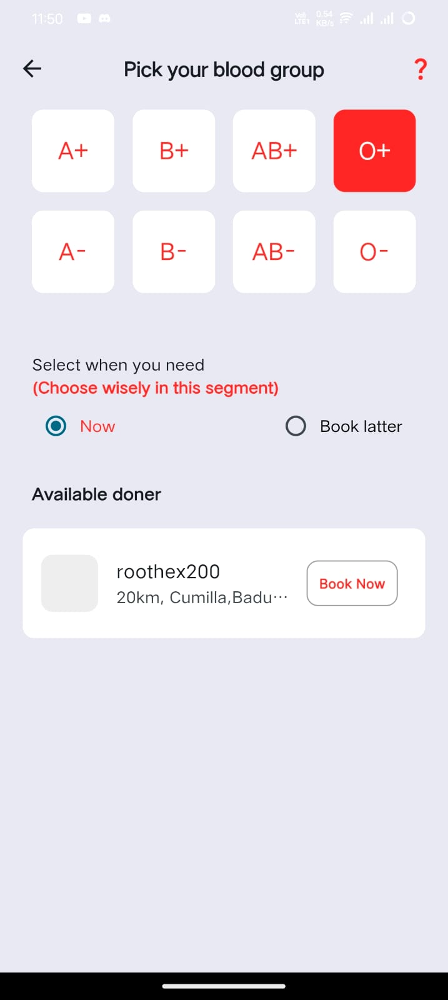
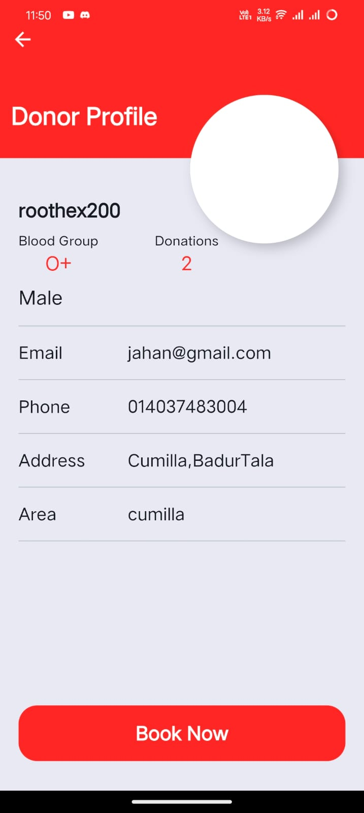
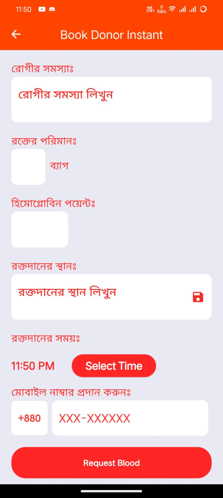
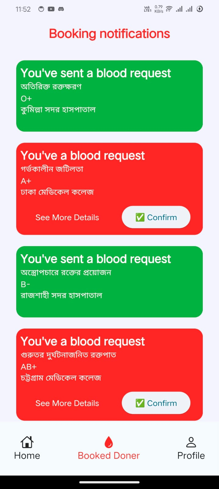

# My Blood - Find Blood Donors Instantly 🚑💉

Welcome to **My Blood** — an app designed to connect people in urgent need of blood with local donors. In emergencies, finding a matching blood donor quickly is crucial, and *My Blood* makes this possible in just a few taps. Built for humanity and community, *My Blood* aims to make life-saving connections easier and faster.

## 💡 Key Features

- **Find a Donor**: Search for blood donors by blood group and location. View profiles of available donors and contact them instantly.
- **Book a Donor**: Book a donor for immediate assistance or schedule for a later time based on your needs.
- **Register as a Donor**: Become a blood donor by registering with your verified email. Your profile can help others find you when they need it most.
- **Dual Profiles**: 
  - **Personal Profile**: View and manage your own information and achievements.
  - **Donor Profile**: This profile is shown to those searching for donors, displaying relevant information like blood group, contact details, etc.
- **Direct Call to Donors**: Use the built-in direct call feature to connect with a donor instantly during emergencies.
- **Notifications**: Get real-time notifications for blood requests and bookings.


## 📲 Screenshots

Here are some screenshots of the *My Blood* app to give you an overview of its UI and functionality.

### Login Screen


### Home Screen


### Profile Screen


### Donor Registration Screen


### Find Donor Screen


### Donor Profile Screen


### Donor Request Screen


### Notificaton Screen


## 🔧 Technology Stack

- **Flutter**: Cross-platform mobile development for beautiful and performant UI.
- **GetX**: State management and routing for a seamless user experience.
- **Dio**: HTTP client for handling network requests.
- **flutter_direct_caller**: Enables quick direct calls to donors in the app.

## 📥 Installation Guide

Follow these steps to run the project on your local machine:

1. **Clone the repository**:
   ```bash
   git clone [myBlood](https://github.com/alphabetic100/myblood.git)
   cd my-blood
   ```

2. **Install dependencies**:
   ```bash
   flutter pub get
   ```

3. **Run the app**:
   ```bash
   flutter run
   ```

## 📂 Folder Structure

```
──lib
│   ├───auth
│   │   ├───controller
│   │   ├───log-in
│   │   │   └───controllers
│   │   └───screens
│   │       └───sign-up
│   │           ├───controller
│   │           └───screen
│   ├───data
│   └───src
│       ├───constants
│       ├───core
│       │   ├───common
│       │   │   └───widget
│       │   └───utils
│       └───feature
│           ├───add-blood-donor
│           ├───booked-donor
│           │   ├───booking-notifier
│           │   ├───others
│           │   │   ├───bookings-for-latter
│           │   │   │   └───screens
│           │   │   └───instant-booking
│           │   │       ├───api
│           │   │       ├───controller
│           │   │       └───screen
│           │   └───screens
│           ├───find-donor
│           │   ├───api
│           │   ├───components
│           │   ├───controller
│           │   ├───donor_profile
│           │   │   └───components
│           │   └───screens
│           ├───home
│           │   ├───components
│           │   ├───controller
│           │   └───view
│           └───profile
│               ├───donor-profile
│               ├───personal_profile_components
│               └───screen
```

## 🤝 Contributing

If you'd like to contribute to *My Blood*, please follow these steps:

1. **Fork the repository**.
2. **Create a new branch** for your feature or fix.
3. **Commit your changes** and push your branch.
4. **Submit a pull request** for review.

## 👏 Join Us in Making a Difference!

*My Blood* is more than an app — it’s a movement for compassion, unity, and support. Join us in our mission to save lives, one donation at a time. Whether you're looking for a donor or signing up to be one, thank you for being a part of this journey!

---

Feel free to update links and details to match your project’s specifics. This README template is ready to paste directly into your repository!